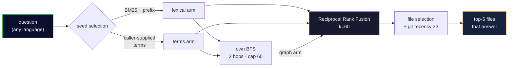

<div align="center">

[Português](README.md) • **English**

# 🧠 cerebro-engine

### Make your AI agent **ask the code graph** instead of blindly reading 30 files.

A **local, free and measurable** retrieval layer on top of
[graphify](https://github.com/safishamsi/graphify): it turns a natural-language question into the
**few files that actually answer it** — fewer tokens, faster answer.

[](https://nodejs.org)
[](LICENSE)
[]()
[](MEDICOES.en.md)
[]()

<br>


</div>

---

## 🎯 The problem

An agent that opens 30 files to answer one question **burns tokens and time**. A code graph
(tree-sitter symbols + Leiden communities, via graphify) turns *"where's the logic that keeps the
punctuation in the subtitles?"* into a **pointer to the two files that matter**.

The graph is the **index**; the file is the **truth** — always confirm in the real code before editing.

## 💻 In practice

```console
$ node ask.mjs "where is the auth token validated" my-backend

Traversal: seeds=[validate_token() · verify_jwt() · AuthMiddleware] | rewrite=chamador | 12 nodes in 3 files

NODE validate_token()   [src=app/auth/token.py       loc=L42  community=3]
NODE verify_jwt()       [src=app/auth/token.py       loc=L58  community=3]
NODE AuthMiddleware     [src=app/middleware/auth.py  loc=L11  community=3]
NODE require_auth()     [src=app/deps.py             loc=L20  community=7]
…
[the graph is an index — confirm in the file before editing]
```

*(illustrative output; the format is real)*

---

## 🔬 How it works



### 1. The map: what's inside `graph.json`

**graphify** does the indexing: it runs tree-sitter over the repository and writes a `graph.json` with

- **nodes** — every function, class, method and file, with `label` (the symbol name), `source_file`,
  `loc` (the line), and the Leiden community it belongs to;
- **edges** — who calls whom, who imports whom, who defines what;
- **`rationale` nodes** — docstrings and explanatory comments, linked to the symbol they describe.
  They are what lets the prose of the code take part in the search.

This project **indexes nothing**: it only reads that file. That's why it costs $0 and runs offline.

### 2. Three arms, because none of them is enough alone

The question becomes three ranked lists of candidate nodes, each with a different bias:

| arm | how it scores | what it catches |
|---|---|---|
| **lexical** | BM25 (`k1=1.2`, `b=0.75`, literature defaults) over the symbol name, the file path and the docstring | the word you typed appears in the code |
| **terms** | same scoring, but over the **English** identifiers the caller supplied | the language bridge (below) |
| **graph** | BFS from the top 8 seeds, 2 hops, cap of 60 nodes, decaying with `1/(1+distance)` | the neighbour the question doesn't name, but which answers it |

### 3. The language bridge — the whole trick

You ask *"where does it keep the **pontuação**"* and the code is called
`split_string_by_punctuations`. Not a single word matches. Two things cross that gap:

**Prefix matching.** A question term matches a code token when it is a **prefix** of it and is at
least 4 characters long — `portugues` ⊂ `portuguese`. The 4-character floor exists to stop `som`
from matching `awesome`. This works as an accidental cross-lingual stemmer, and it was found by
accident: [the "correct" exact-token version failed the blind set](MEDICOES.en.md#the-training-set-isnt-enough--and-heres-the-proof).

**Caller-supplied terms.** The main path doesn't guess the translation — it **receives** it. Over
MCP the host model fills the English identifiers in by itself; in the terminal you pass
`--termos "auth,token,validate"`. Whoever asks translates better than any automatic bridge, because
they know the conversation. With no terms the engine falls back to a local cache; with no cache, to
pure lexical — and it **names the path it took** in every answer
(`rewrite=chamador | cache | sem-termos | desligado`).

### 4. The hardening: stopping the popular symbol from always winning

Inherited from [aider's repo-map](https://aider.chat/2023/10/22/repomap.html), and it's what
separates this from `grep` with a ranking:

- **degree damping — `1/√(1+refs)`.** A symbol referenced 99 times (`log`, `init`, `utils`) is worth
  10× less than one referenced once. Without it, the hub node monopolises every question.
- **`×0.1` for generic.** Short name, private (`_helper`), or defined in more than 5 files.
- **`×10` for well-named.** A descriptive identifier of 8+ characters —
  `split_string_by_punctuations` says what it does, `p2` doesn't.

> In Go and C, where short names are idiomatic, the bonus barely fires. Unlock it with
> `CEREBRO_W_BEMNOMEADO=1 CEREBRO_MIN_IDENT=4`.

### 5. The fusion: RRF, not a sum of scores

The three arms produce scores on incomparable scales — you can't add BM25 to a graph distance.
[Reciprocal Rank Fusion](https://dl.acm.org/doi/10.1145/1571941.1572114) solves it by fusing
**positions**, not values:

$$\text{RRF}(node) = \sum_{arm} \frac{1}{60 + \text{rank of the node in that arm}}$$

`k=60` is Cormack's canonical constant (2009). The practical effect: a node that comes 3rd in all
three arms beats a node that is 1st in only one. **Agreement is worth more than a peak.**

### 6. Picking the files

Nodes add their scores to their files, the top 5 files pass, and only the nodes **inside them** are
returned. One last spice applies here: a file touched in git in the last 30 days gets **×3**.

The weight is ×3 and not more because that was measured: [at ×50 it stopped being a tie-breaker and
became a dominant term](MEDICOES.en.md#-what-these-numbers-do-not-prove) — any recently edited file
outranked any relevant one. Recency matches on the **full path**, never on the basename: otherwise
every `utils.py` in a Django project would collect the bonus together.

### 7. Broad questions go through another door

*"How does this project work?"* isn't a traversal question — it's a summary question. The engine
detects that shape (and discards any question that names an identifier) and returns the project
summary, **with its date and age in plain sight**. A stale summary presented as current is worse
than no summary at all.

---

## 🚀 Install

**Requirements:** **Node 22+** and **[graphify](https://github.com/safishamsi/graphify)**
(`uv tool install graphifyy`). No API key — the engine is 100% local.

> graphify's `[gemini]` extra is **not required** by this engine. It powers graphify's own LLM
> features (`extract`, `label` — naming the communities), which this project does not use. If you
> want those, install `"graphifyy[gemini]"` and configure **its** key; nothing here will ask for one.

```bash
git clone https://github.com/kamusmg/cerebro-engine
cd cerebro-engine
cp projects.example.json projects.json      # list YOUR repos: { name, root }

# build a graph per repo (graphify does the indexing)
graphify update "/absolute/path/to/my-backend"

# ask
node ask.mjs "where is the auth token validated" my-backend --termos "auth,token,validate"
node ask.mjs --lista                          # projects that already have a graph
```

> ⚠️ **On first use, pass `--termos`.** The translation cache (`.rewrite-cache.json`) **does not ship
> with the clone** — it holds identifiers from the author's projects, so git ignores it. In a fresh
> clone it is empty, and a question in one language against code in another falls back to pure
> lexical: the engine **says so** (`rewrite=sem-termos`), but the result will be poor.
>
> Over **MCP** the problem doesn't arise: the host model fills the terms in by itself.

**Flags:** `--termos "a,b,c"` (translate the question yourself) · `--sem-rewrite` (disable the terms
arm — this is how you measure the baseline) · `--cru` (raw, no re-rank).

**Env:** `CEREBRO_LEXICO=legado|bm25|prefixo` · `CEREBRO_W_BEMNOMEADO` · `CEREBRO_MIN_IDENT` ·
`CEREBRO_MIN_PREFIXO` · `CEREBRO_W_RECENTE` · `CEREBRO_CACHE_RO=1` (never write to the cache —
mandatory in any measurement).

## 🔌 As an MCP tool (Claude Desktop, Cursor, Antigravity…)

Instead of running it in a terminal, plug cerebro-engine in as a **native** tool over
[MCP](https://modelcontextprotocol.io) — then the AI calls it on its own. It exposes two tools:
**`ask_graph`** and **`list_projects`**. In `claude_desktop_config.json` (or your client's
equivalent):

```json
{
  "mcpServers": {
    "cerebro-engine": {
      "command": "node",
      "args": ["/absolute/path/to/cerebro-engine/mcp-server.mjs"]
    }
  }
}
```

Zero runtime dependencies — the MCP protocol is hand-implemented (the project is vanilla by choice).
The server keeps the graph in RAM between calls, revalidating by `mtime` on every query.

## 🧪 Tests

```bash
npm test          # 62 tests in node:test, ~150ms, zero runtime dependencies
npm run typecheck # JSDoc + @ts-check (uses typescript, in devDependencies)
```

The suite pins the six knobs that decide the ranking — prefix anchor, RRF `k`, degree damping, BFS
depth and cap, generic penalty. Each was verified by mutation: break any one of them in the engine
and a test turns red.

## 📊 Measured

| engine path | recall | hit@3 | MRR |
|---|:---:|:---:|:---:|
| caller-supplied `--termos` (production) | 20/24 | 17/24 | **0.701** |
| rewrite-cache hit | **21/24** | 17/24 | 0.636 |
| `--sem-rewrite` (baseline) | 17/24 | 14/24 | 0.533 |

On a second golden set, **built backwards on purpose** and never used to tune anything:
**14/14 · MRR 0.869**.

> 📖 **[The full record is in `MEDICOES.en.md`](MEDICOES.en.md)** — the method, the composition of
> the golden sets, what these numbers do **not** prove, and the three times this project published a
> wrong number and had to correct itself in public. If you're going to compare against your own
> retriever, read that first: an aggregate number without the golden set's composition means almost
> nothing.

## ⚠️ Scope & honest limits

- **100% local, no key at all:** terms come from WHOEVER ASKS (you typing `--termos`, or the model
  calling over MCP). With no terms it falls back to the local cache; with no cache, to lexical search.
- **REPO scale, not giant-monorepo scale:** `graph.json` is loaded whole into memory. For
  personal/medium repos (hundreds–thousands of nodes) it flies; a monorepo of hundreds of MB would
  one day want an on-disk index (SQLite/DuckDB).
- **The graph can go stale:** this is only the **search**. After a large refactor, run
  `graphify update` again (the auto-sync layer is not part of this engine).
- **Semantic blindness:** the AST sees explicit calls. Dependency injection, magic decorators and
  dynamic routing do not become edges.

## 📚 Prior art (nothing created, everything copied)

- Ranking from **[aider](https://aider.chat/2023/10/22/repomap.html)**'s repo-map — `sqrt(refs)` is what
  stops a frequent symbol from dominating.
- The language bridge is **[HyDE](https://arxiv.org/abs/2212.10496)**-adjacent (query rewriting).
- Fusion by **[RRF](https://dl.acm.org/doi/10.1145/1571941.1572114)** (k=60), Cormack 2009.
- Embeddings are **deliberately not** used: the rewrite bridge already gives full recall on targets that
  exist in the graph, and (as **[Cody](https://sourcegraph.com/blog/how-cody-understands-your-codebase)**
  concluded) they weren't worth the index maintenance. They stay pre-wired as a 4th RRF arm, should a
  larger golden set ever ask for them.

## 🧭 Principles

- **The graph is the index; the file is the truth.** It points; you confirm in the code.
- **If the number looks too good, the method is wrong.** Here the numbers are measured and the ruler ships with them.
- **Measure before building.** The embeddings arm wasn't built because the data didn't ask for it.
- **Degradation has a name.** Every answer states which path it took. Silence would be the worst defect.

## 📄 License

[MIT](LICENSE). Made in Brazil 🇧🇷 by [kamusmg](https://github.com/kamusmg).
