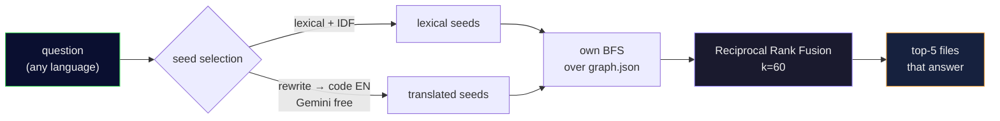

<div align="center">

[Português](README.md) • **English**

# 🧠 cerebro-engine

### Make your AI agent **ask the code graph** instead of blindly reading 30 files.

A **local, free, measurable** retrieval layer over [graphify](https://github.com/safishamsi/graphify):
it turns a natural-language question into the **handful of files that actually answer it** — fewer
tokens, faster answers.

[](https://nodejs.org)
[](LICENSE)
[]()
[]()

<br>


</div>

---

> **Honest positioning:** this does **not** promise "8x savings." It hands you the **method and the
> harness** so you **measure the savings on your own code**. If the number looks too good, the method is
> wrong — so the harness ships with it.

## 🎯 The problem

An agent that opens 30 files to answer one question **burns tokens and time**. A code graph (tree-sitter
symbols + Leiden communities, via graphify) turns *"where's the logic that keeps punctuation in
subtitles?"* into a **pointer to the two files that matter**.

The graph is the **index**; the file is the **truth** — always confirm in the real code before editing.

## ✨ What it does

| | |
|---|---|
| 🔎 **`ask.mjs`** | Question → the files/symbols that answer it. Hybrid retrieval: lexical + a **cross-language query-rewrite bridge** (ask in one language, code in another? it crosses that) + graph traversal, fused with **Reciprocal Rank Fusion** (k=60). |
| ⚙️ **`retrieval.mjs`** | The engine: own seed selection over `graph.json` with aider-style hardening (`sqrt(refs)` so frequent symbols don't dominate, `×0.1` generic, `×10` well-named), own BFS, RRF. |
| 📏 **`harness-recall.mjs`** | Measures **recall / hit@3 / MRR** on a golden set **you** build from your repos. |

## 💻 In practice

```console
$ node ask.mjs "where is the auth token validated" my-backend

Traversal: seeds=[validate_token() · verify_jwt() · AuthMiddleware] | rewrite=gemini | 12 nodes in 3 files

NODE validate_token()   [src=app/auth/token.py       loc=L42  community=3]
NODE verify_jwt()       [src=app/auth/token.py       loc=L58  community=3]
NODE AuthMiddleware     [src=app/middleware/auth.py  loc=L11  community=3]
NODE require_auth()     [src=app/deps.py             loc=L20  community=7]
…
[the graph is an index — confirm in the file before editing]
```

*(illustrative output; the format is real)*

## 📊 Measured — on TWO golden sets, one of them held out

| retriever | recall | hit@3 | MRR |
|---|:---:|:---:|:---:|
| graph BFS (baseline) | 15/24 | 14/24 | 0.529 |
| hybrid + rewrite + RRF | 20/24 | **19/24** | 0.653 |
| **+ BM25 with prefix matching** | **20/24** | 18/24 | **0.693** |

The 4 residual misses are **coverage** (Arduino/`.ino` symbols the parser doesn't extract), **not**
retrieval. On targets that exist in the graph: **20/20**. Reproduce with `node harness-recall.mjs`.

> ⚠️ **Don't read this table without the composition of the golden set.** Most of these questions
> fall in the regime where plain text search would already work, which inflates any aggregate number.
> See [what these numbers do **not** prove](#-what-these-numbers-do-not-prove) before comparing
> against your own.

### The training set isn't enough — and here's the proof

The 24 questions above are **training**: they and the tuning they justify were born together. So there
is a second set, **built backwards on purpose** — the target is sampled mechanically (fixed seed)
among documented nodes, and only **then** is the question written from what that code does. It has
never been used to tune anything.

**It rejected the first version of this very improvement.** Textbook BM25 with exact-token matching
looked great on training (recall 20→**21**, MRR 0.653→**0.733** with a tuned `k1`) and collapsed on
the held-out set (recall **11/14** vs 12/14 for the older code), with the tuned `k1` scoring
*identically* to the default — the tuning bought nothing.

The cause: the substring matching that the "fix" removed was working as an **accidental cross-lingual
stemmer**. When questions are written in one language and identifiers are English, the question's word
is often a **prefix** of its English cognate (`portugues` ⊂ `portuguese`). Hence the final design:
BM25 with literature-default `k1`/`b`, and **prefix** matching.

| | training (24) | held-out (14) | nodes/question |
|---|---|---|---|
| substring (previous) | MRR 0.653 | recall 12 · MRR 0.721 | 36.4 |
| BM25 exact token | MRR 0.691 | recall **11** · MRR 0.693 | 34.6 |
| **prefix + BM25 (default)** | MRR **0.693** | recall 12 · MRR **0.764** | **34.6** |

A/B at any time: `CEREBRO_LEXICO=legado|bm25|prefixo`.

> **If you benchmark your own retriever, steal this and not the number:** a golden set you tuned
> against no longer measures the engine, it measures the set. Build the second one backwards (target
> first, by sampling; question afterwards) and run it **once per change**.

## ⚖️ What these numbers do **not** prove

An aggregate number hides **what kind** of questions were asked. Following
[CodeCompass](https://arxiv.org/abs/2602.20048), which evaluates code retrieval across three regimes,
every question is classified **mechanically** — the graph decides, not the author:

| | the target is… | what would already find it |
|---|---|---|
| **G1** | named by a term in the question itself | `grep` |
| **G2** | ≤2 hops from something the question names | traversal — **this is where a graph should pay off** |
| **G3** | neither named nor reachable by short traversal | only a semantic index |

And the result is uncomfortable:

| | composition | G1 | G2 | G3 |
|---|---|---|---|---|
| training (24) | 71% G1 | 16/17 · MRR **0.843** | 2/2 · hit@3 **0/2** | 2/5 |
| held-out (14) | **86% G1** | 12/12 · MRR **0.892** | n=1 | n=1 |

**In other words: `MRR 0.764` is effectively the G1 number** — the regime where keyword search would
already work. The engine is very good there. In the regime that would justify a graph existing, it is
**unproven**, for two different reasons:

- **G2 is a RANKING defect, not a retrieval one.** Recall 2/2, hit@3 **0/2**: the engine **finds the
  target and buries it**. The cause is known — graph distance only takes 3 values, so dozens of nodes
  tie and the tie-break ends up being BFS insertion order. *(We tried breaking ties by convergence,
  summing `1/(1+d)` across seeds: it regressed both sets and cost +51% tokens, most likely because it
  rewards hub nodes — exactly what the `sqrt(refs)` damping exists to prevent. If that's your first
  idea, it was ours too, and it didn't work.)*
- **G3 has no sample to conclude anything from** (n=1 on each side), and claiming otherwise would be
  making things up.

> **The honest reading:** what's demonstrated here is **token economy** — the same answer from a
> fraction of the context. **Superiority over `grep` is not demonstrated**, because the golden set is
> mostly the kind of question `grep` gets right. If you publish numbers for your retriever, publish
> the **composition** alongside them: without it, "MRR 0.76" can mean very different things.

## 🚀 Install

**Prereqs:** **Node 22+**, **[graphify](https://github.com/safishamsi/graphify)**
(`uv tool install "graphifyy[gemini]"`), and optionally a **`GEMINI_API_KEY`** (free tier) for the
cross-language rewrite.

```bash
git clone https://github.com/kamusmg/cerebro-engine
cd cerebro-engine
cp projects.example.json projects.json      # list YOUR repos: { name, root }

# build a graph per repo (graphify does the indexing)
graphify update "/absolute/path/to/my-backend"

# ask
node ask.mjs "where is the auth token validated" my-backend
node ask.mjs --lista                          # projects that have a graph

# measure recall on your own golden set
cp reports/golden-questions.example.json reports/golden-questions.json   # edit with YOUR questions
node harness-recall.mjs
```

**Flags:** `--motor=graphify` (A/B vs raw graphify) · `--sem-rewrite` (disable the language bridge) ·
`--cru` (raw, no re-rank).

## 🔌 As an MCP tool (Claude Desktop, Cursor, Antigravity…)

Instead of the terminal, plug cerebro-engine in as a **native** tool via
[MCP](https://modelcontextprotocol.io) — the AI then calls it itself, no command to type. It exposes
two tools: **`ask_graph`** and **`list_projects`**. In `claude_desktop_config.json` (or your client's
equivalent):

```json
{
  "mcpServers": {
    "cerebro-engine": {
      "command": "node",
      "args": ["/absolute/path/to/cerebro-engine/mcp-server.mjs"]
    }
  }
}
```

Zero dependencies — the MCP protocol is implemented by hand (the project is vanilla by choice).

## 🔬 How it works



## 📚 Prior art (nothing created, everything copied)

- Repo-map ranking from **[aider](https://aider.chat/2023/10/22/repomap.html)** — the `sqrt(refs)` damping
  is what stops frequent symbols dominating.
- The language bridge is **[HyDE](https://arxiv.org/abs/2212.10496)**-adjacent query rewriting.
- Fusion is **[RRF](https://dl.acm.org/doi/10.1145/1571941.1572114)** (k=60).
- Embeddings are deliberately **not** used: the rewrite bridge already gets full recall on extractable
  targets, and (like **[Cody](https://sourcegraph.com/blog/how-cody-understands-your-codebase)**) they
  weren't worth the index-maintenance cost. Pre-wired as a 4th RRF arm if a bigger benchmark ever needs it.

## 🧭 Principles

- **The graph is the index; the file is the truth.** It points; you confirm in code.
- **If the number looks too good, the method is wrong.** Numbers here are measured, method stated.
- **Measure before you build.** The embedding arm wasn't built because the data didn't ask for it.

## ⚠️ Scope & honest limits

- **"Local" has an asterisk:** the query-rewrite bridge makes **one call to Gemini** (free tier).
  Everything else — graph, BFS, RRF — is 100% local. With no internet/key it **warns** and falls back
  to lexical search (`--sem-rewrite` forces that). Future: a local model (Ollama).
- **Repo-scale, not giant-monorepo scale:** `graph.json` is loaded fully into memory. Fast for
  personal/medium repos (hundreds–thousands of nodes); a hundreds-of-MB monorepo would eventually need
  an on-disk index (SQLite/DuckDB).
- **The graph can go stale:** this is just the **retriever**. After a big refactor, re-run
  `graphify update` (the auto-sync layer isn't part of this engine).
- **Tunable heuristics:** weights are tuned for descriptive names (Python/JS). For Go/C (short names),
  unlock via env: `CEREBRO_W_BEMNOMEADO=1 CEREBRO_MIN_IDENT=4`.

## 📄 License

[MIT](LICENSE). Made in Brazil 🇧🇷 by [kamusmg](https://github.com/kamusmg).
