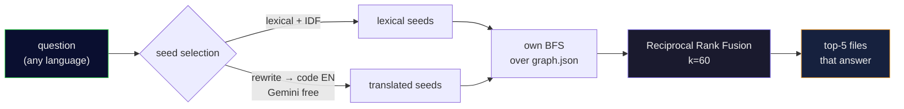

<div align="center">

[Português](README.md) • **English**

# 🧠 cerebro-engine

### Make your AI agent **ask the code graph** instead of blindly reading 30 files.

A **local, free, measurable** retrieval layer over [graphify](https://github.com/safishamsi/graphify):
it turns a natural-language question into the **handful of files that actually answer it** — fewer
tokens, faster answers.

[](https://nodejs.org)
[](LICENSE)
[]()
[]()

<br>


</div>

---

> **Honest positioning:** this does **not** promise "8x savings." It hands you the **method and the
> harness** so you **measure the savings on your own code**. If the number looks too good, the method is
> wrong — so the harness ships with it.

## 🎯 The problem

An agent that opens 30 files to answer one question **burns tokens and time**. A code graph (tree-sitter
symbols + Leiden communities, via graphify) turns *"where's the logic that keeps punctuation in
subtitles?"* into a **pointer to the two files that matter**.

The graph is the **index**; the file is the **truth** — always confirm in the real code before editing.

## ✨ What it does

| | |
|---|---|
| 🔎 **`ask.mjs`** | Question → the files/symbols that answer it. Hybrid retrieval: lexical + a **cross-language query-rewrite bridge** (ask in one language, code in another? it crosses that) + graph traversal, fused with **Reciprocal Rank Fusion** (k=60). |
| ⚙️ **`retrieval.mjs`** | The engine: own seed selection over `graph.json` with aider-style hardening (`sqrt(refs)` so frequent symbols don't dominate, `×0.1` generic, `×10` well-named), own BFS, RRF. |
| 📏 **`harness-recall.mjs`** | Measures **recall / hit@3 / MRR** on a golden set **you** build from your repos. |

## 💻 In practice

```console
$ node ask.mjs "where is the auth token validated" my-backend

Traversal: seeds=[validate_token() · verify_jwt() · AuthMiddleware] | rewrite=gemini | 12 nodes in 3 files

NODE validate_token()   [src=app/auth/token.py       loc=L42  community=3]
NODE verify_jwt()       [src=app/auth/token.py       loc=L58  community=3]
NODE AuthMiddleware     [src=app/middleware/auth.py  loc=L11  community=3]
NODE require_auth()     [src=app/deps.py             loc=L20  community=7]
…
[the graph is an index — confirm in the file before editing]
```

*(illustrative output; the format is real)*

## 📊 Measured (author's 24-question golden set, ground truth verified by grep)

| retriever | recall | hit@3 | MRR |
|---|:---:|:---:|:---:|
| graph BFS (baseline) | 15/24 | 14/24 | 0.529 |
| **this (hybrid + rewrite + RRF)** | **20/24** | **19/24** | **0.653** |

The 4 residual misses are **coverage** (Arduino/`.ino` symbols the parser doesn't extract), **not**
retrieval. On targets that exist in the graph: **20/20**. Reproduce with `node harness-recall.mjs`.

## 🚀 Install

**Prereqs:** **Node 22+**, **[graphify](https://github.com/safishamsi/graphify)**
(`uv tool install "graphifyy[gemini]"`), and optionally a **`GEMINI_API_KEY`** (free tier) for the
cross-language rewrite.

```bash
git clone https://github.com/kamusmg/cerebro-engine
cd cerebro-engine
cp projects.example.json projects.json      # list YOUR repos: { name, root }

# build a graph per repo (graphify does the indexing)
graphify update "/absolute/path/to/my-backend"

# ask
node ask.mjs "where is the auth token validated" my-backend
node ask.mjs --lista                          # projects that have a graph

# measure recall on your own golden set
cp reports/golden-questions.example.json reports/golden-questions.json   # edit with YOUR questions
node harness-recall.mjs
```

**Flags:** `--motor=graphify` (A/B vs raw graphify) · `--sem-rewrite` (disable the language bridge) ·
`--cru` (raw, no re-rank).

## 🔬 How it works



## 📚 Prior art (nothing created, everything copied)

- Repo-map ranking from **[aider](https://aider.chat/2023/10/22/repomap.html)** — the `sqrt(refs)` damping
  is what stops frequent symbols dominating.
- The language bridge is **[HyDE](https://arxiv.org/abs/2212.10496)**-adjacent query rewriting.
- Fusion is **[RRF](https://dl.acm.org/doi/10.1145/1571941.1572114)** (k=60).
- Embeddings are deliberately **not** used: the rewrite bridge already gets full recall on extractable
  targets, and (like **[Cody](https://sourcegraph.com/blog/how-cody-understands-your-codebase)**) they
  weren't worth the index-maintenance cost. Pre-wired as a 4th RRF arm if a bigger benchmark ever needs it.

## 🧭 Principles

- **The graph is the index; the file is the truth.** It points; you confirm in code.
- **If the number looks too good, the method is wrong.** Numbers here are measured, method stated.
- **Measure before you build.** The embedding arm wasn't built because the data didn't ask for it.

## 📄 License

[MIT](LICENSE). Made in Brazil 🇧🇷 by [kamusmg](https://github.com/kamusmg).
