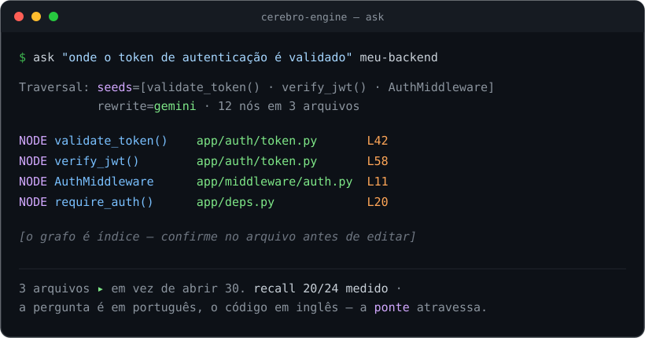
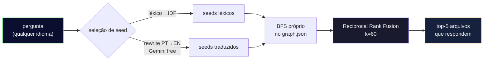

<div align="center">

**Português** • [English](README.en.md)

# 🧠 cerebro-engine

### Faça o seu agente de IA **perguntar ao grafo do código** em vez de abrir 30 arquivos no escuro.

Uma camada de busca **local, grátis e medível** por cima do [graphify](https://github.com/safishamsi/graphify):
transforma uma pergunta em linguagem natural nos **poucos arquivos que realmente respondem** — menos
tokens, resposta mais rápida.

[](https://nodejs.org)
[](LICENSE)
[]()
[]()
[]()

<br>



</div>

---

> **Postura honesta:** isto **não** promete "economize 8x". Ele te entrega o **método e a régua** pra você
> **medir a economia no seu próprio código**. Se o número parecer bom demais, o método está errado — por
> isso a régua vem junto.

## 🎯 O problema

Um agente que abre 30 arquivos pra responder uma pergunta **queima tokens e tempo**. Um grafo do código
(símbolos por tree-sitter + comunidades por Leiden, via graphify) transforma *"onde fica a lógica que
mantém a pontuação na legenda?"* num **ponteiro pros dois arquivos que importam**.

O grafo é o **índice**; o arquivo é a **verdade** — sempre confirme no código real antes de editar.

## ✨ O que ele faz

| | |
|---|---|
| 🔎 **`ask.mjs`** | Pergunta → os arquivos/símbolos que respondem. Busca híbrida: léxico + **ponte de tradução da pergunta** (pergunta em português, código em inglês? ele atravessa) + travessia no grafo, fundidos com **Reciprocal Rank Fusion** (k=60). |
| ⚙️ **`retrieval.mjs`** | O motor: seleção de *seed* própria sobre o `graph.json`, com endurecimento estilo aider (`sqrt(refs)` pra símbolo frequente não dominar, `×0.1` genérico, `×10` bem-nomeado), BFS próprio e RRF. |
| 📏 **`harness-recall.mjs`** | Mede **recall / hit@3 / MRR** num gabarito que **você** monta a partir dos seus repos. |

## 💻 Na prática

```console
$ node ask.mjs "onde o token de autenticação é validado" meu-backend

Traversal: seeds=[validate_token() · verify_jwt() · AuthMiddleware] | rewrite=gemini | 12 nós em 3 arquivos

NODE validate_token()   [src=app/auth/token.py       loc=L42  community=3]
NODE verify_jwt()       [src=app/auth/token.py       loc=L58  community=3]
NODE AuthMiddleware     [src=app/middleware/auth.py  loc=L11  community=3]
NODE require_auth()     [src=app/deps.py             loc=L20  community=7]
…
[o grafo é índice — confirme no arquivo antes de editar]
```

*(saída ilustrativa; o formato é esse)*

## 📊 Medido — em DOIS gabaritos, um deles held-out

| recuperador | recall | hit@3 | MRR |
|---|:---:|:---:|:---:|
| BFS do grafo (linha de base) | 15/24 | 14/24 | 0.529 |
| híbrido + rewrite + RRF | 20/24 | **19/24** | 0.653 |
| **+ BM25 com casamento por prefixo** | **20/24** | 18/24 | **0.693** |

As 4 furadas restantes são **cobertura** (símbolos Arduino/`.ino` que o parser não extrai), **não** recall.
Nos alvos que existem no grafo: **20/20**. Reproduza com `node harness-recall.mjs`.

> ⚠️ **Não leia esta tabela sem a composição do gabarito.** A maioria destas perguntas cai no regime
> em que uma busca textual já resolveria — o que infla qualquer número agregado. Os detalhes estão em
> [o que estes números **não** provam](#-o-que-estes-números-não-provam), e vale a pena ler antes de
> comparar com o seu.

### O gabarito de treino não basta — e a prova disso

As 24 perguntas acima são **treino**: elas e os ajustes que elas justificam nasceram juntos. Por isso
existe um segundo gabarito, **construído ao contrário de propósito** — o alvo é sorteado
mecanicamente (semente fixa) entre nós com docstring, e só **depois** a pergunta é escrita a partir
do que a função faz. Ele nunca foi usado pra ajustar nada.

**Ele reprovou a primeira versão desta melhoria.** BM25 clássico com token exato parecia ótimo no
treino (recall 20→**21**, MRR 0.653→**0.733** com `k1` afinado) e desabou no held-out (recall
**11/14** contra 12/14 do código antigo), com o `k1` afinado rendendo resultado **idêntico** ao
default — a afinação comprou zero.

A causa: o casamento por substring que a "correção" eliminou funcionava como um **radicalizador
cross-lingual acidental**. Quando a pergunta vem num idioma e os identificadores são ingleses, a
palavra da pergunta é com frequência **prefixo** do cognato (`portugues` ⊂ `portuguese`). Daí o
desenho final: BM25 com `k1`/`b` nos **defaults da literatura** e casamento **por prefixo**.

| | treino (24) | held-out (14) | nós/pergunta |
|---|---|---|---|
| substring (anterior) | MRR 0.653 | recall 12 · MRR 0.721 | 36.4 |
| BM25 token exato | MRR 0.691 | recall **11** · MRR 0.693 | 34.6 |
| **prefixo + BM25 (padrão)** | MRR **0.693** | recall 12 · MRR **0.764** | **34.6** |

A/B a qualquer momento: `CEREBRO_LEXICO=legado|bm25|prefixo`.

> **Se você for medir seu próprio retriever, roube isto e não o número:** um gabarito onde você
> ajustou parâmetros não mede mais o motor, mede o gabarito. Construa o segundo ao contrário
> (alvo primeiro, por sorteio; pergunta depois) e rode-o **uma vez por mudança**.

## ⚖️ O que estes números **não** provam

Um número agregado esconde **de que tipo** eram as perguntas. Seguindo o
[CodeCompass](https://arxiv.org/abs/2602.20048), que mede recuperação de código em três regimes,
classificamos cada pergunta **mecanicamente** — quem decide é o grafo, não o autor:

| | o alvo é… | quem já resolveria |
|---|---|---|
| **G1** | nomeado por um termo da própria pergunta | `grep` |
| **G2** | a ≤2 saltos de algo que a pergunta nomeia | travessia — **é aqui que o grafo deveria pagar** |
| **G3** | nem nomeado nem alcançável por travessia curta | só um índice semântico |

E o resultado é desconfortável:

| | composição | G1 | G2 | G3 |
|---|---|---|---|---|
| treino (24) | 71% G1 | 16/17 · MRR **0.843** | 2/2 · hit@3 **0/2** | 2/5 |
| held-out (14) | **86% G1** | 12/12 · MRR **0.892** | n=1 | n=1 |

**Ou seja: o `MRR 0.764` é, na prática, o número do G1** — o regime em que a busca por palavra já
funcionaria. O motor é muito bom nele. No regime que justificaria um grafo existir, ele é
**não-provado**, e em dois pontos por motivos diferentes:

- **G2 é um defeito de ORDENAÇÃO, não de recuperação.** Recall 2/2, hit@3 **0/2**: o motor **acha o
  alvo e o enterra no fim da lista**. A causa é conhecida — a distância no grafo só assume 3 valores,
  então dezenas de nós empatam e o desempate acaba sendo a ordem de inserção do BFS. *(Já tentamos
  desempatar por convergência, somando `1/(1+d)` sobre cada seed: piorou os dois gabaritos e custou
  +51% de token. Provavelmente porque premia o nó-hub, que é justamente o que o damping `sqrt(refs)`
  existe pra conter. Se essa for sua primeira ideia — foi a nossa, e não funcionou.)*
- **Sobre G3 não há amostra pra concluir nada** (n=1 de cada lado), e dizer o contrário seria inventar.

> **A leitura honesta:** o que está demonstrado aqui é **economia de token** — a mesma resposta com
> uma fração do contexto. **Superioridade sobre `grep` não está demonstrada**, porque o gabarito é
> majoritariamente do tipo que o `grep` acerta. Se você publicar números do seu retriever, publique a
> **composição** junto: sem ela, "MRR 0.76" pode significar coisas muito diferentes.

## 🚀 Instalação

**Pré-requisitos:** **Node 22+**, o **[graphify](https://github.com/safishamsi/graphify)**
(`uv tool install "graphifyy[gemini]"`) e, opcionalmente, uma **`GEMINI_API_KEY`** (free tier) pra ponte
de tradução da pergunta.

```bash
git clone https://github.com/kamusmg/cerebro-engine
cd cerebro-engine
cp projects.example.json projects.json      # liste os SEUS repos: { name, root }

# construa um grafo pra cada repo (quem indexa é o graphify)
graphify update "/caminho/absoluto/do/meu-backend"

# pergunte
node ask.mjs "onde o token de autenticação é validado" meu-backend
node ask.mjs --lista                          # projetos que já têm grafo

# meça o recall no seu próprio gabarito
cp reports/golden-questions.example.json reports/golden-questions.json   # edite com SUAS perguntas
node harness-recall.mjs
```

**Flags:** `--motor=graphify` (A/B contra o graphify puro) · `--sem-rewrite` (desliga a ponte de idioma) ·
`--cru` (bruto, sem re-rank).

## 🔌 Como ferramenta MCP (Claude Desktop, Cursor, Antigravity…)

Em vez de rodar no terminal, plugue o cerebro-engine como ferramenta **nativa** via
[MCP](https://modelcontextprotocol.io) — aí a IA chama sozinha, sem você digitar comando. Ele
expõe duas ferramentas: **`ask_graph`** e **`list_projects`**. No `claude_desktop_config.json`
(ou equivalente do seu cliente):

```json
{
  "mcpServers": {
    "cerebro-engine": {
      "command": "node",
      "args": ["/caminho/absoluto/pro/cerebro-engine/mcp-server.mjs"]
    }
  }
}
```

Zero dependência — o protocolo MCP é implementado à mão (o projeto é vanilla por escolha).

## 🔬 Como funciona



A ponte de idioma é o pulo do gato: você pergunta *"onde mantém a **pontuação**"* e o motor encontra
`split_string_by_punctuations` mesmo o código estando **todo em inglês**.

## 📚 De onde veio (nada se cria, tudo se copia)

- Ranking do repo-map do **[aider](https://aider.chat/2023/10/22/repomap.html)** — o `sqrt(refs)` é o que
  impede símbolo frequente de dominar.
- A ponte de idioma é **[HyDE](https://arxiv.org/abs/2212.10496)**-adjacente (reescrita da consulta).
- Fusão por **[RRF](https://dl.acm.org/doi/10.1145/1571941.1572114)** (k=60).
- Embeddings **de propósito não** são usados: a ponte de rewrite já dá recall total nos alvos que existem
  no grafo, e (como a **[Cody](https://sourcegraph.com/blog/how-cody-understands-your-codebase)** concluiu)
  não valiam o custo de manter o índice. Ficam pré-fiados como um 4º braço do RRF, se um gabarito maior um
  dia pedir.

## 🧭 Princípios

- **O grafo é o índice; o arquivo é a verdade.** Ele aponta; você confirma no código.
- **Se o número parece bom demais, o método está errado.** Aqui os números são medidos e o método vem junto.
- **Medir antes de construir.** O braço de embeddings não foi feito porque o dado não pediu.

## ⚠️ Escopo e limites (honestos)

- **"Local" tem um asterisco:** a ponte de tradução da pergunta (rewrite) faz **1 chamada ao Gemini**
  (free tier). O resto — grafo, BFS, RRF — é 100% local. Sem internet/chave, ele **avisa** e cai pra
  busca léxica (`--sem-rewrite` força isso). Futuro: modelo local (Ollama).
- **Escala de REPO, não de monorepo gigante:** o `graph.json` é carregado inteiro na memória. Pra
  repos pessoais/médios (centenas–milhares de nós) voa; um monorepo de centenas de MB um dia pediria
  índice em disco (SQLite/DuckDB).
- **O grafo pode ficar velho:** este é só o **buscador**. Depois de um refactor grande, rode
  `graphify update` de novo (a camada de auto-sync não faz parte deste engine).
- **Heurísticas ajustáveis:** os pesos são afinados pra nomes descritivos (Python/JS). Em Go/C (nome
  curto), destrave via env: `CEREBRO_W_BEMNOMEADO=1 CEREBRO_MIN_IDENT=4`.

## 📄 Licença

[MIT](LICENSE). Feito no Brasil 🇧🇷 por [kamusmg](https://github.com/kamusmg).
