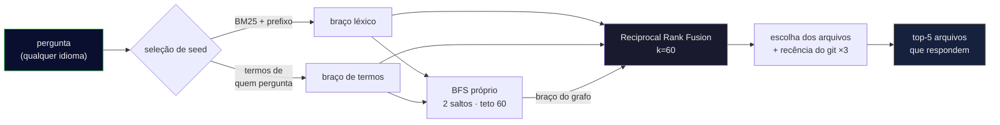

<div align="center">

**Português** • [English](README.en.md)

# 🧠 cerebro-engine

### Faça o seu agente de IA **perguntar ao grafo do código** em vez de abrir 30 arquivos no escuro.

Uma camada de busca **local, grátis e medível** por cima do [graphify](https://github.com/safishamsi/graphify):
transforma uma pergunta em linguagem natural nos **poucos arquivos que realmente respondem** — menos
tokens, resposta mais rápida.

[](https://nodejs.org)
[](LICENSE)
[]()
[](MEDICOES.md)
[]()

<br>


</div>

---

## 🎯 O problema

Um agente que abre 30 arquivos pra responder uma pergunta **queima tokens e tempo**. Um grafo do código
(símbolos por tree-sitter + comunidades por Leiden, via graphify) transforma *"onde fica a lógica que
mantém a pontuação na legenda?"* num **ponteiro pros dois arquivos que importam**.

O grafo é o **índice**; o arquivo é a **verdade** — sempre confirme no código real antes de editar.

## 💻 Na prática

```console
$ node ask.mjs "onde o token de autenticação é validado" meu-backend

Traversal: seeds=[validate_token() · verify_jwt() · AuthMiddleware] | rewrite=chamador | 12 nós em 3 arquivos

NODE validate_token()   [src=app/auth/token.py       loc=L42  community=3]
NODE verify_jwt()       [src=app/auth/token.py       loc=L58  community=3]
NODE AuthMiddleware     [src=app/middleware/auth.py  loc=L11  community=3]
NODE require_auth()     [src=app/deps.py             loc=L20  community=7]
…
[o grafo é índice — confirme no arquivo antes de editar]
```

*(saída ilustrativa; o formato é esse)*

---

## 🔬 Como funciona



### 1. O mapa: o que o `graph.json` tem dentro

Quem indexa é o **graphify**: ele passa o tree-sitter no repositório e escreve um `graph.json` com

- **nós** — cada função, classe, método e arquivo, com `label` (o nome do símbolo), `source_file`,
  `loc` (a linha), e a comunidade Leiden a que pertence;
- **arestas** — quem chama quem, quem importa quem, quem define o quê;
- **nós de `rationale`** — docstrings e comentários explicativos, ligados ao símbolo que descrevem.
  São eles que deixam a prosa do código entrar na busca.

Este projeto **não indexa nada**: ele só lê esse arquivo. É por isso que ele custa $0 e roda offline.

### 2. Três braços, porque nenhum sozinho basta

A pergunta vira três listas ordenadas de nós candidatos, cada uma com um viés diferente:

| braço | como pontua | o que ele pega |
|---|---|---|
| **léxico** | BM25 (`k1=1.2`, `b=0.75`, defaults da literatura) sobre o nome do símbolo, o caminho do arquivo e a docstring | a palavra que você digitou aparece no código |
| **termos** | mesma pontuação, mas sobre os identificadores **em inglês** que quem pergunta forneceu | a ponte de idioma (veja abaixo) |
| **grafo** | BFS a partir dos 8 melhores seeds, 2 saltos, teto de 60 nós, decaindo com `1/(1+distância)` | o vizinho que a pergunta não nomeia, mas que responde |

### 3. A ponte de idioma — o pulo do gato

Você pergunta *"onde mantém a **pontuação**"* e o código se chama `split_string_by_punctuations`.
Nenhuma palavra bate. Duas coisas atravessam esse vão:

**Casamento por prefixo.** Um termo da pergunta casa com um token do código quando é **prefixo** dele
e tem pelo menos 4 caracteres — `portugues` ⊂ `portuguese`, `pontuac` ⊂ `pontuacao`. O mínimo de 4
existe pra impedir que `som` case com `awesome`. Isso funciona como um radicalizador cross-lingual
acidental, e foi descoberto por acaso: [a versão "correta" com token exato reprovou no gabarito
cego](MEDICOES.md#o-gabarito-de-treino-não-basta--e-a-prova-disso).

**Termos de quem pergunta.** O caminho principal não tenta adivinhar a tradução — ele **recebe**.
Via MCP, o modelo hospedeiro preenche os identificadores em inglês sozinho; no terminal, você passa
`--termos "auth,token,validate"`. Quem pergunta traduz melhor que qualquer ponte automática, porque
conhece a conversa. Sem termos, o motor cai no cache local; sem cache, no léxico puro — e **avisa
qual caminho usou** em toda resposta (`rewrite=chamador | cache | sem-termos | desligado`).

### 4. O endurecimento: impedir que o símbolo popular ganhe sempre

Herdado do [repo-map do aider](https://aider.chat/2023/10/22/repomap.html), e é o que separa isto de
um `grep` com ranking:

- **amortecimento por grau — `1/√(1+refs)`.** Um símbolo referenciado 99 vezes (`log`, `init`,
  `utils`) vale 10× menos que um referenciado uma vez. Sem isso, o nó-hub monopoliza toda pergunta.
- **`×0.1` pro genérico.** Nome curto, privado (`_helper`) ou definido em mais de 5 arquivos.
- **`×10` pro bem-nomeado.** Identificador descritivo com 8+ caracteres — `split_string_by_punctuations`
  diz o que faz, `p2` não.

> Em Go e C, onde nome curto é idiomático, o bônus quase não dispara. Destrave com
> `CEREBRO_W_BEMNOMEADO=1 CEREBRO_MIN_IDENT=4`.

### 5. A fusão: RRF, não soma de pontos

Os três braços produzem pontuações em escalas incomparáveis — não dá pra somar BM25 com distância de
grafo. O [Reciprocal Rank Fusion](https://dl.acm.org/doi/10.1145/1571941.1572114) resolve fundindo
**posições**, não valores:

$$\text{RRF}(nó) = \sum_{braço} \frac{1}{60 + \text{posição do nó naquele braço}}$$

O `k=60` é a constante canônica de Cormack (2009). O efeito prático: um nó que aparece em 3º lugar
nos três braços ganha de um nó que é 1º em um só. **Concordância vale mais que pico.**

### 6. A escolha final dos arquivos

Os nós somam pontos pros seus arquivos, os 5 melhores arquivos passam, e só os nós **dentro deles**
são devolvidos. Aqui entra o último tempero: arquivo tocado no git nos últimos 30 dias leva **×3**.

O peso é ×3 e não mais porque isso foi medido: [a ×50 ele deixava de ser desempate e virava termo
dominante](MEDICOES.md#-o-que-estes-números-não-provam) — qualquer arquivo recém-editado batia
qualquer arquivo relevante. A recência casa por **caminho completo**, nunca por nome: senão todo
`utils.py` de um projeto Django ganharia o bônus junto.

### 7. Pergunta ampla tem outra porta

*"Como funciona este projeto?"* não é pergunta de travessia — é pergunta de resumo. O motor detecta
esse formato (e descarta qualquer pergunta que nomeie um identificador) e devolve o resumo do
projeto, **com a data e a idade dele visíveis**. Resumo velho apresentado como se fosse de hoje é
pior que resumo nenhum.

---

## 🚀 Instalação

**Pré-requisitos:** **Node 22+** e o **[graphify](https://github.com/safishamsi/graphify)**
(`uv tool install graphifyy`). Nenhuma chave de API — o motor é 100% local.

> O extra `[gemini]` do graphify **não é necessário** para este motor. Ele serve às features de
> LLM do próprio graphify (`extract`, `label` — dar nome às comunidades), que este projeto não
> usa. Se quiser essas features do graphify, instale `"graphifyy[gemini]"` e configure a chave
> **dele**; nada aqui vai pedir chave.

```bash
git clone https://github.com/kamusmg/cerebro-engine
cd cerebro-engine
node setup.mjs /caminho/absoluto/do/meu-backend
```

É isso. O `setup.mjs` confere o Node, instala o graphify se faltar, registra o repo, indexa e
**faz uma pergunta de verdade** pra provar que funciona — imprimindo os nós que voltaram. Se
qualquer passo falhar, ele diz **qual** e o que fazer; se ele não conseguir *verificar* um passo,
diz isso também, com `?`, em vez de fingir que deu certo.

Rodar de novo é seguro: ele não duplica cadastro nem reindexa à toa.

<details>
<summary>Prefere fazer à mão?</summary>

```bash
cp projects.example.json projects.json      # liste os SEUS repos: { name, root }
graphify update "/caminho/absoluto/do/meu-backend"   # quem indexa é o graphify
node ask.mjs "onde o token é validado" meu-backend --termos "auth,token,validate"
node ask.mjs --lista                        # projetos que já têm grafo
```

Se o `graphify` não estiver no PATH depois de instalado (acontece no Windows), aponte o caminho:
`GRAPHIFY_BIN=/caminho/completo/graphify`.

</details>

> ⚠️ **No primeiro uso, passe `--termos`.** O cache de tradução (`.rewrite-cache.json`) **não vem
> no clone** — ele guarda identificadores dos projetos do autor, então é ignorado pelo git. Num
> clone limpo ele está vazio, e uma pergunta em português contra código em inglês cai no léxico
> puro: o motor **avisa** (`rewrite=sem-termos`), mas o resultado será ruim.
>
> Pelo **MCP** o problema não aparece: o modelo hospedeiro preenche os termos sozinho.

**Flags:** `--termos "a,b,c"` (traduz a pergunta você mesmo) · `--sem-rewrite` (desliga o braço de
termos — é assim que se mede o baseline) · `--grafo` (força a travessia mesmo numa pergunta ampla).

**Env** — as 10 que o código lê: `CEREBRO_LEXICO=legado|bm25|prefixo` · `CEREBRO_W_BEMNOMEADO` ·
`CEREBRO_W_GENERICO` · `CEREBRO_MIN_IDENT` · `CEREBRO_MIN_PREFIXO` · `CEREBRO_W_RECENTE` ·
`CEREBRO_BM25_K1` · `CEREBRO_BM25_B` · `CEREBRO_SEM_REWRITE` · `CEREBRO_CACHE_RO=1` (não grava no
cache — obrigatório em qualquer medição).

## 🔌 Como ferramenta MCP (Claude Desktop, Cursor, Antigravity…)

Em vez de rodar no terminal, plugue o cerebro-engine como ferramenta **nativa** via
[MCP](https://modelcontextprotocol.io) — aí a IA chama sozinha, sem você digitar comando. Ele
expõe duas ferramentas: **`ask_graph`** e **`list_projects`**. No `claude_desktop_config.json`
(ou equivalente do seu cliente):

```json
{
  "mcpServers": {
    "cerebro-engine": {
      "command": "node",
      "args": ["/caminho/absoluto/pro/cerebro-engine/mcp-server.mjs"]
    }
  }
}
```

Zero dependência em runtime — o protocolo MCP é implementado à mão (o projeto é vanilla por
escolha). O servidor mantém o grafo em RAM entre chamadas, revalidando por `mtime` a cada consulta.

## 🧪 Testes

```bash
npm test          # 62 testes em node:test, ~150ms, zero dependência em runtime
npm run typecheck # JSDoc + @ts-check (usa typescript, em devDependencies)
```

A suíte trava os seis botões que decidem o ranking — âncora de prefixo, `k` do RRF, amortecimento de
grau, profundidade e teto do BFS, penalidade de genérico. Cada um foi verificado por mutação: quebre
qualquer um deles no motor e um teste fica vermelho.

## 📊 Medido

| caminho do motor | recall | hit@3 | MRR |
|---|:---:|:---:|:---:|
| `--termos` de quem pergunta (produção) | 20/24 | 17/24 | **0.701** |
| acerto no cache de rewrite | **21/24** | 17/24 | 0.636 |
| `--sem-rewrite` (baseline) | 17/24 | 14/24 | 0.512 |
> ⚠ **Reconferido em 26/08/2026, com a régua consertada.** O caminho de produção reproduziu na
> terceira casa: **20/24 · 17/24 · 0.701**. O baseline **não**: deu MRR **0.512** contra os 0.533
> publicados antes. Não foi o conserto da régua — o harness anterior, sem uma linha mudada, dá
> 0.512 hoje também — nem a recência, que desligada não move o número. **A causa continua
> desconhecida**, e fica escrito assim em vez de virar explicação bonita. A linha do cache não roda
> neste clone (o `.rewrite-cache.json` aqui está vazio), mas foi reconferida no motor gêmeo do autor
> e reproduziu **exata: 21/24 · 17/24 · 0.636**. E o baseline dá 0.512 nos DOIS motores hoje — dois
> códigos diferentes, mesmo número: a diferença contra o 0.533 não está no código.
>
> E os acertos são casados por **basename**: o gabarito não carrega caminho, então a pasta não é
> verificada. Um `utils.py` da pasta errada contaria. O harness agora **imprime esse número em
> toda rodada**, em vez de deixá-lo escondido no meio dos acertos que provam a pasta.

Num segundo gabarito, **construído ao contrário de propósito** e nunca usado pra ajustar nada:
**14/14 · MRR 0.869**.

> 📖 **[O registro completo está em `MEDICOES.md`](MEDICOES.md)** — o método, a composição dos
> gabaritos, o que estes números **não** provam, e as três vezes em que o projeto publicou um número
> errado e teve que se corrigir em público. Se você for comparar com o seu retriever, leia aquilo
> antes: um número agregado sem a composição do gabarito não quer dizer quase nada.

## ⚠️ Escopo e limites (honestos)

- **100% local, sem chave nenhuma:** os termos vêm de QUEM PERGUNTA (você digitando `--termos`, ou o
  modelo que chama via MCP). Sem termos, cai pro cache local; sem cache, busca léxica.
- **Escala de REPO, não de monorepo gigante:** o `graph.json` é carregado inteiro na memória. Pra
  repos pessoais/médios (centenas–milhares de nós) voa; um monorepo de centenas de MB um dia pediria
  índice em disco (SQLite/DuckDB).
- **O grafo pode ficar velho:** este é só o **buscador**. Depois de um refactor grande, rode
  `graphify update` de novo (a camada de auto-sync não faz parte deste engine).
- **Cegueira semântica:** a AST enxerga chamada explícita. Injeção de dependência, decorators mágicos
  e roteamento dinâmico não viram aresta.

## 📚 De onde veio (nada se cria, tudo se copia)

- Ranking do repo-map do **[aider](https://aider.chat/2023/10/22/repomap.html)** — o `sqrt(refs)` é o que
  impede símbolo frequente de dominar.
- A ponte de idioma é **[HyDE](https://arxiv.org/abs/2212.10496)**-adjacente (reescrita da consulta).
- Fusão por **[RRF](https://dl.acm.org/doi/10.1145/1571941.1572114)** (k=60), Cormack 2009.
- Embeddings **de propósito não** são usados: a ponte de rewrite já dá recall total nos alvos que existem
  no grafo, e (como a **[Cody](https://sourcegraph.com/blog/how-cody-understands-your-codebase)** concluiu)
  não valiam o custo de manter o índice. Ficam pré-fiados como um 4º braço do RRF, se um gabarito maior um
  dia pedir.

## 🧭 Princípios

- **O grafo é o índice; o arquivo é a verdade.** Ele aponta; você confirma no código.
- **Se o número parece bom demais, o método está errado.** Aqui os números são medidos e a régua vem junto.
- **Medir antes de construir.** O braço de embeddings não foi feito porque o dado não pediu.
- **Degrade tem nome.** Toda resposta diz por qual caminho passou. Silêncio seria o pior defeito.

## 📄 Licença

[MIT](LICENSE). Feito no Brasil 🇧🇷 por [kamusmg](https://github.com/kamusmg).
