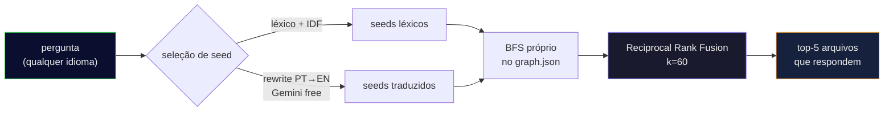

<div align="center">

**Português** • [English](README.en.md)

# 🧠 cerebro-engine

### Faça o seu agente de IA **perguntar ao grafo do código** em vez de abrir 30 arquivos no escuro.

Uma camada de busca **local, grátis e medível** por cima do [graphify](https://github.com/safishamsi/graphify):
transforma uma pergunta em linguagem natural nos **poucos arquivos que realmente respondem** — menos
tokens, resposta mais rápida.

[](https://nodejs.org)
[](LICENSE)
[]()
[]()
[]()

<br>


</div>

---

> **Postura honesta:** isto **não** promete "economize 8x". Ele te entrega o **método e a régua** pra você
> **medir a economia no seu próprio código**. Se o número parecer bom demais, o método está errado — por
> isso a régua vem junto.

## 🎯 O problema

Um agente que abre 30 arquivos pra responder uma pergunta **queima tokens e tempo**. Um grafo do código
(símbolos por tree-sitter + comunidades por Leiden, via graphify) transforma *"onde fica a lógica que
mantém a pontuação na legenda?"* num **ponteiro pros dois arquivos que importam**.

O grafo é o **índice**; o arquivo é a **verdade** — sempre confirme no código real antes de editar.

## ✨ O que ele faz

| | |
|---|---|
| 🔎 **`ask.mjs`** | Pergunta → os arquivos/símbolos que respondem. Busca híbrida: léxico + **ponte de tradução da pergunta** (pergunta em português, código em inglês? ele atravessa) + travessia no grafo, fundidos com **Reciprocal Rank Fusion** (k=60). |
| ⚙️ **`retrieval.mjs`** | O motor: seleção de *seed* própria sobre o `graph.json`, com endurecimento estilo aider (`sqrt(refs)` pra símbolo frequente não dominar, `×0.1` genérico, `×10` bem-nomeado), BFS próprio e RRF. |
| 📏 **`harness-recall.mjs`** | Mede **recall / hit@3 / MRR** num gabarito que **você** monta a partir dos seus repos. |

## 💻 Na prática

```console
$ node ask.mjs "onde o token de autenticação é validado" meu-backend

Traversal: seeds=[validate_token() · verify_jwt() · AuthMiddleware] | rewrite=gemini | 12 nós em 3 arquivos

NODE validate_token()   [src=app/auth/token.py       loc=L42  community=3]
NODE verify_jwt()       [src=app/auth/token.py       loc=L58  community=3]
NODE AuthMiddleware     [src=app/middleware/auth.py  loc=L11  community=3]
NODE require_auth()     [src=app/deps.py             loc=L20  community=7]
…
[o grafo é índice — confirme no arquivo antes de editar]
```

*(saída ilustrativa; o formato é esse)*

## 📊 Medido (gabarito de 24 perguntas do autor, gabarito verificado por grep)

| recuperador | recall | hit@3 | MRR |
|---|:---:|:---:|:---:|
| BFS do grafo (linha de base) | 15/24 | 14/24 | 0.529 |
| **este (híbrido + rewrite + RRF)** | **20/24** | **19/24** | **0.653** |

As 4 furadas restantes são **cobertura** (símbolos Arduino/`.ino` que o parser não extrai), **não** recall.
Nos alvos que existem no grafo: **20/20**. Reproduza com `node harness-recall.mjs`.

## 🚀 Instalação

**Pré-requisitos:** **Node 22+**, o **[graphify](https://github.com/safishamsi/graphify)**
(`uv tool install "graphifyy[gemini]"`) e, opcionalmente, uma **`GEMINI_API_KEY`** (free tier) pra ponte
de tradução da pergunta.

```bash
git clone https://github.com/kamusmg/cerebro-engine
cd cerebro-engine
cp projects.example.json projects.json      # liste os SEUS repos: { name, root }

# construa um grafo pra cada repo (quem indexa é o graphify)
graphify update "/caminho/absoluto/do/meu-backend"

# pergunte
node ask.mjs "onde o token de autenticação é validado" meu-backend
node ask.mjs --lista                          # projetos que já têm grafo

# meça o recall no seu próprio gabarito
cp reports/golden-questions.example.json reports/golden-questions.json   # edite com SUAS perguntas
node harness-recall.mjs
```

**Flags:** `--motor=graphify` (A/B contra o graphify puro) · `--sem-rewrite` (desliga a ponte de idioma) ·
`--cru` (bruto, sem re-rank).

## 🔬 Como funciona



A ponte de idioma é o pulo do gato: você pergunta *"onde mantém a **pontuação**"* e o motor encontra
`split_string_by_punctuations` mesmo o código estando **todo em inglês**.

## 📚 De onde veio (nada se cria, tudo se copia)

- Ranking do repo-map do **[aider](https://aider.chat/2023/10/22/repomap.html)** — o `sqrt(refs)` é o que
  impede símbolo frequente de dominar.
- A ponte de idioma é **[HyDE](https://arxiv.org/abs/2212.10496)**-adjacente (reescrita da consulta).
- Fusão por **[RRF](https://dl.acm.org/doi/10.1145/1571941.1572114)** (k=60).
- Embeddings **de propósito não** são usados: a ponte de rewrite já dá recall total nos alvos que existem
  no grafo, e (como a **[Cody](https://sourcegraph.com/blog/how-cody-understands-your-codebase)** concluiu)
  não valiam o custo de manter o índice. Ficam pré-fiados como um 4º braço do RRF, se um gabarito maior um
  dia pedir.

## 🧭 Princípios

- **O grafo é o índice; o arquivo é a verdade.** Ele aponta; você confirma no código.
- **Se o número parece bom demais, o método está errado.** Aqui os números são medidos e o método vem junto.
- **Medir antes de construir.** O braço de embeddings não foi feito porque o dado não pediu.

## 📄 Licença

[MIT](LICENSE). Feito no Brasil 🇧🇷 por [kamusmg](https://github.com/kamusmg).
